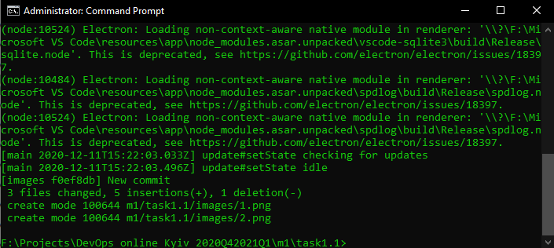

 From this task, I have learned:
 1. How to operate with local git repo
 2. How to merge/delete branches
 3. How to push your changes to GitHub

-------------------

In my opinion, DevOps is a collaborative approach that enables development and 
operations teams to continuous deliver software in quick cycles while reducing
overhead, duplication and rework.
DevOps help tackle the complexities and challenges posed by the cloud, allowing solutions to be delivered and updated quickly and reliably.

