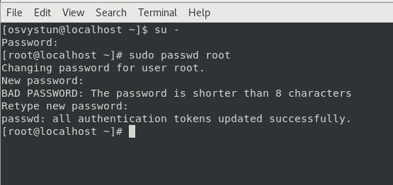
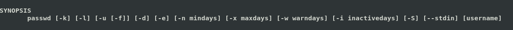
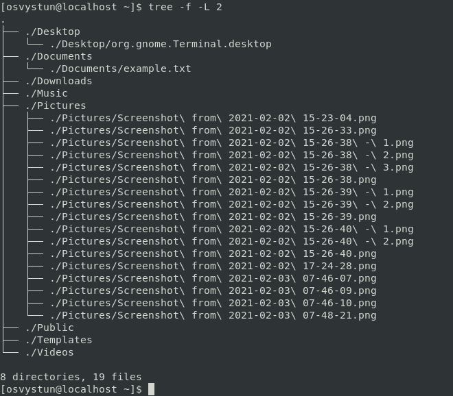
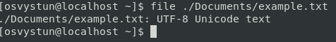
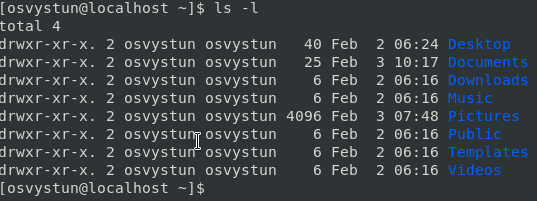

<h2>Task 1. Part 1</h2>

1. Login in to the system as a root.

2. Use a passwd command to change the password. Examine the basic parameters of the command. What system file does it change ?

Answer: a passwd command change a passwd file in /etc/ directory. Basically you change information about users that may log into the system.

3. Determine the users registered in the system, as well as what commands they execute. What additional information can be gleaned from the command execution?

4. Change personal info about yourself.

5. Become familiar with the Linux help system and the man and info commands. Get help on the previously discussed commands, define and describe any two keys for these commands. Give examples.

1) cat - standart Unix utility that reads files sequentially, writing them to standart output.

cat -n example.txt - number all output lines

cat -E example.txt - displays "$" sign at the end of each line

2) passwd - Unix command use to change user's password

passwd -S - command that output a short information about the status of the password for given account.

passwd -n - command that set the minimum number of days between password changes

6. Explore the more and less commands using the help system. View the contents of files .bash using commands.

less

more

7) * Describe in plans that you are working on laboratory work 1. Tip: You should read the documentation for the finger command.

8) * List the contents of the home directory using the ls command, define its files and directories. Hint: Use the help system to familiarize yourself with the ls command.

<h2>Task 1. Part 2</h2>

1) Examine the tree command. Master the technique of applying a template, for example, display all files that contain a character c, or files that contain a specific sequence of characters. List subdirectories of the root directory up to and including the second nesting level.

2) What command can be used to determine the type of file (for example, text or binary)? Give an example.

Answer: command file is used to determine the type of file.

3) Master the skills of navigating the file system using relative and absolute paths. How can you go back to your home directory from anywhere in the filesystem?

Absolute path: 

Relative path:

To navigate to home directory, you can use "cd" command.

4) Become familiar with the various options for the ls command. Give examples of listing directories using different keys. Explain the information displayed on the terminal using the -l and -a switches.

ls -l - list directory contents using a long listing format

ls -a - list directory contents(and files/directories starting with .)

5) Perform the following sequence of operations:
- create a subdirectory in the home directory;

- in this subdirectory create a file containing information about directories located in the root directory (using I/O redirection operations);

- view the created file;

- copy the created file to your home directory using relative and absolute addressing.

- delete the previously created subdirectory with the file requesting removal;

- delete the file copied to the home directory.

6) Perform the following sequence of operations:
- create a subdirectory test in the home directory;

- copy the .bash_history file to this directory while changing its name to labwork2;

- create a hard and soft link to the labwork2 file in the test subdirectory;

- how to define soft and hard link, what do these
concepts;

Answer:
Hard link is a file that points to the same underlying node, as another file. Whereas a symbolic link(soft link) is a link to another filename in the filesystem.

- change the data by opening a symbolic link. What changes will happen and why;

- rename the hard link file to hard_lnk_labwork2;

- rename the soft link file to symb_lnk_labwork2 file;

- then delete the labwork2. What changes have occurred and why?

Answer:
In case of symlink, symlink of that file no longer works or it becomes "danglink link"
In case of hard link, it erases total data of the original file.

7) Using the locate utility, find all files that contain the squid and traceroute sequence.

8) Determine which partitions are mounted in the system, as well as the types of these partitions.

9) Count the number of lines containing a given sequence of characters in a given file.

10) Using the find command, find all files in the /etc directory containing the host character sequence.

11) List all objects in /etc that contain the ss character sequence. How can I duplicate a similar command using a bunch of grep?

No way, actually. grep command is used for searching sequences in files, not name of files.

12) Organize a screen-by-screen print of the contents of the /etc directory. Hint: You must use stream redirection operations.

13) What are the types of devices and how to determine the type of device? Give examples.

Answer:
There are four types of hardware devices: character, block, pipe and socket.
Example of character device: file that transfer data, but one a character at a time.
Example of block device: file that transfer data, but in large fixed-sized block.
Example of pipe device: two or more processes, that communicate with each other and send output to another process.
Example of socket device: device that facilitate communication between processes.

14) How to determine the type of file in the system, what types of files are there?

Answer:
In Linux, you can determine the type of file in the system by file command.
There are seven types of files in Linux: regular type, directory, character device file, block device file, local socket file, named pipe and symbolic link.

15) * List the first 5 directory files that were recently accessed in the /etc directory.