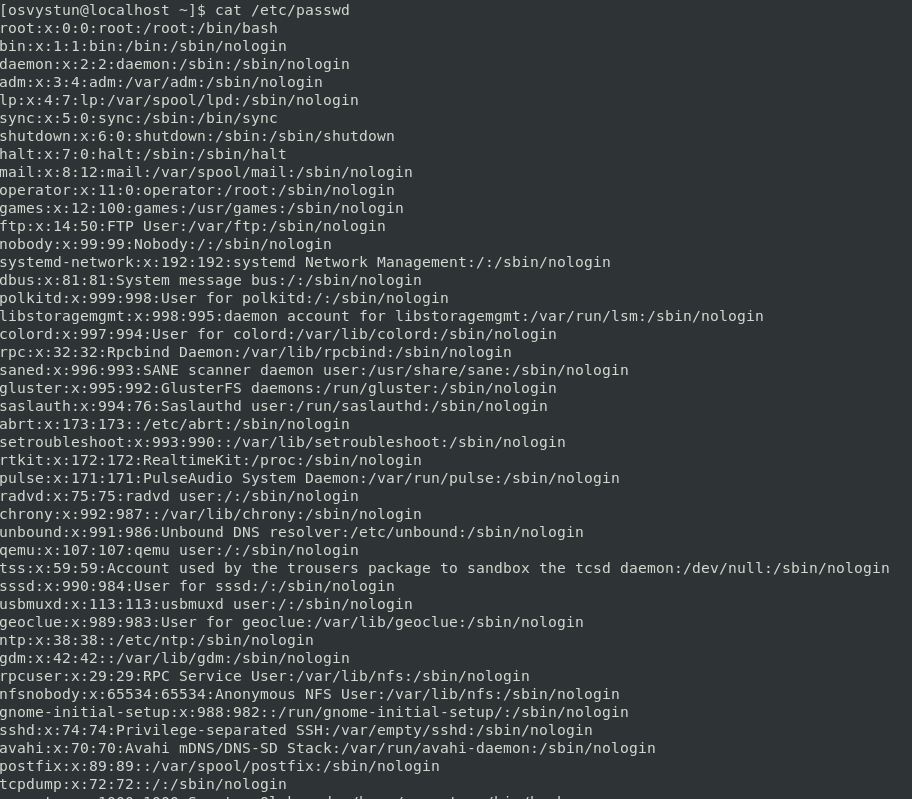
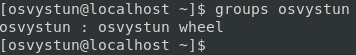
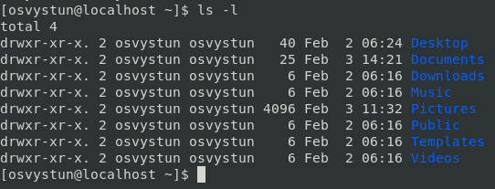
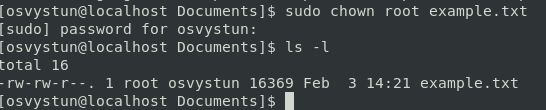
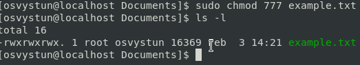

1) Analyze the structure of the /etc/passwd and /etc/group file, what fields are present in it, what users exist on the system? Specify several pseudo-users, how to define them?

Answer:
The /etc/passwd/ basically, is a plain text file, that containts a list of the system's accounts and information about them(user ID, group ID, home directory, shell, etc.).
The /etc/group on the other hand is a text file which defines the groups to which user belong. This file containt group name, password, GID and group list.

There is a lot of users.

2) What are the uid ranges? What is UID? How to define it?

Answer:
UID ranges is the range where Linux specifies UID values.
UID is user identifier(a number assigned for each user on the system).
You can define UID from a /etc/passwd/ file.

3) What is GID? How to define it?

Answer:
GID is group identifier(a number assigned for each group on the system).
GID can be defined in /etc/group/ file.

4) How to determine belonging of user to the specific group?

Answer:
By groups command

5) What are the commands for adding a user to the system? What are the basic parameters required to create a user?

Answer:
useradd or adduser with username.
You only need unique username.

6) How do I change the name (account name) of an existing user?

Answer:
sudo usermod -l newUsername oldUsername

7) What is skell_dir? What is its structure?

Answer:
It is used to initiate home directory when a user is first created.

8) How to remove a user from the system (including his mailbox)?

Answer:
userdel -r USERNAME

9) What commands and keys should be used to lock and unlock a user account?

Answer:
To lock - usermod -L USERNAME
To unlock - usermod -U USERNAME

10) How to remove a user's password and provide him with a password-free login for subsequent password change?

Answer:
For this you need to open configuration file sudo visudo and write this command USERNAME ALL=(ALL) NOPASSWD:ALL. Then you can delete password using sudo passwd -d `USERNAME`

11) Display the extended format of information about the directory, tell about the information columns displayed on the terminal.

Answer:

It displays permissions, links, owner, group, size, time and name.

12) What access rights exist and for whom (i. e., describe the main roles)? Briefly describe the acronym for access rights.

Answer:
For user, group and others.
Read, write and execute.

13) What is the sequence of defining the relationship between the file and the user?

Answer:
Sequence of read, write and execute.

14) What commands are used to change the owner of a file (directory), as well as the mode of access to the file? Give examples, demonstrate on the terminal.

Answer:

chown

15) What is an example of octal representation of access rights? Describe the umask command.

Answer:

umask is a command that is used to assign the default file permission sets for newly created folders and files.

16) Give definitions of sticky bits and mechanism of identifier substitution. Give an example of files and directories with these attributes.

Answer:
sticky bit is a permission bit, that allow only owner or root user to delete or rename the file.
chmod +t DIR

17) What file attributes should be present in the command script?

Answer:
a for append only, c for compressed, e for extent format, i for immutable, u for undeletable.