<h2>Part 1</h2>

1. How many states could has a process in Linux?

Answer:
In Linux, the process may have 5 states:
1) Zombie - the process, that is stopped, but is not removed from the memory.
2) Running - the process, that is active.
3) Stopped - the process, which has been stopped.
4) Sleeping - the process, that is in the sleep state and wait for some event to occur.
5) Uninterruptable sleep - the process, that is in the sleep state and cannnot be stopped(usually happens, when process waits for I/O).

2. Examine the pstree command. Make output (highlight) the chain (ancestors) of the current process.

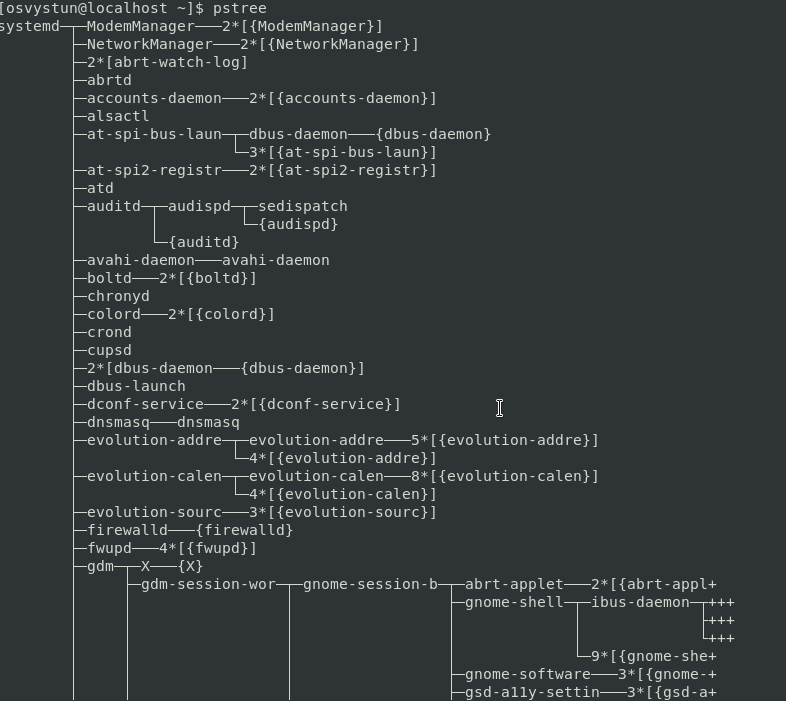

3. What is a proc file system?

Answer:
It is a hierarchy of files which represent the current state of kernel.

4. Print information about the processor (its type, supported technologies, etc.).

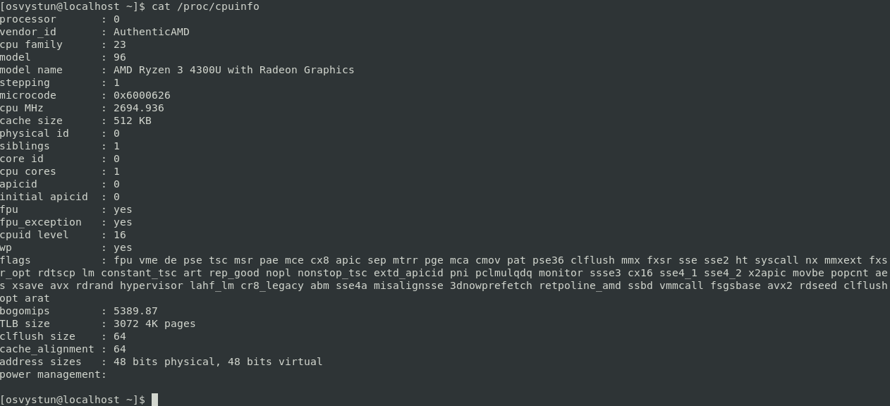

5. Use the ps command to get information about the process. The information should be as follows: the owner of the process, the arguments with which the process was launched for execution, the group owner of this process, etc.

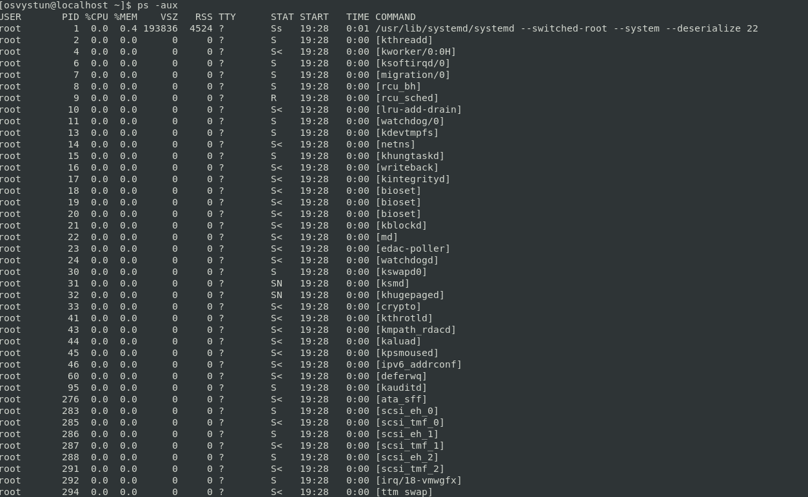

6. How to define kernel processes and user processes?

Answer:
If the path of the process in enclosed in square brackets - it is kernel process, if it is not - it is user process.

7. Print the list of processes to the terminal. Briefly describe the statuses of the processes. What condition are they in, or can they be arriving in?

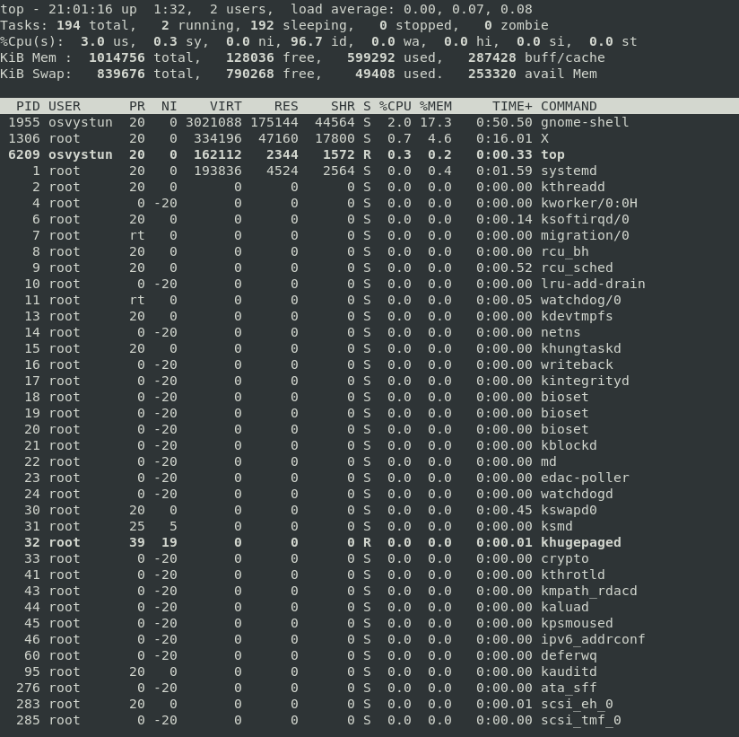
The only processes that are running on this screenshot are top and khugepaged. Other processes are sleeping/stopped.

8. Display only the processes of a specific user.

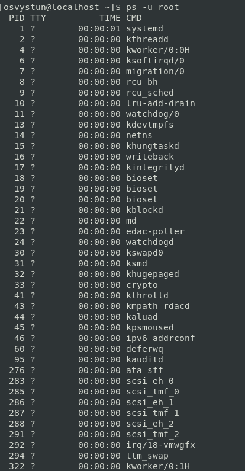

9. What utilities can be used to analyze existing running tasks (by analyzing the help for the ps command)?

Answer:
1) ps -e - see every process.

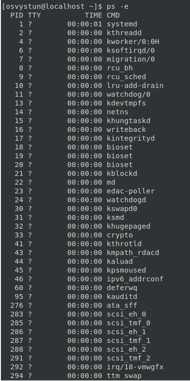

2) ps aux - see process tree.

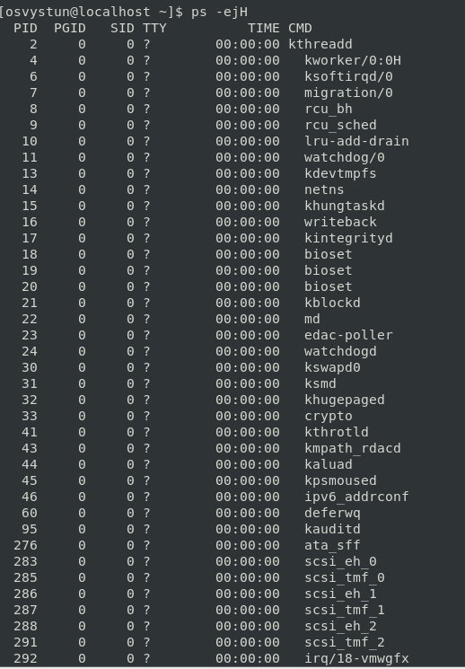

10. What information does top command display?

Answer:
PID, user name, priority, amount of shared memory used by task, nice value of task, memory usage of task, total virtual memory used by the task, cpu usage, time of task being executed, code of state of process and name of the command.

12. Display the processes of the specific user using the top command.

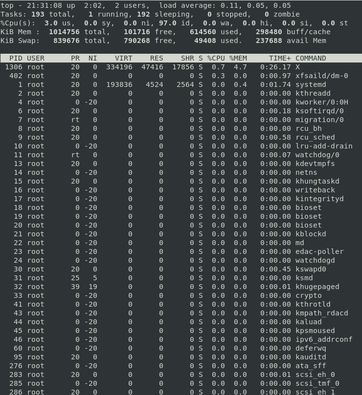

12. What interactive commands can be used to control the top command? Give a couple of examples.

Answer:
1) top -u [USERNAME] - lists all processes for certain user.

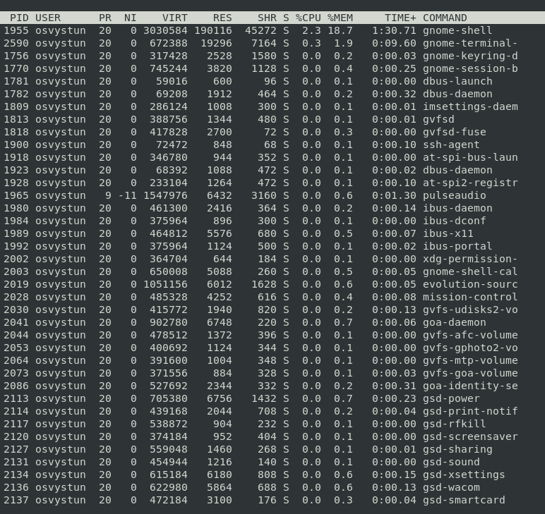

2) top -o %CPU - sorts processes at CPU range from highest to lowest.

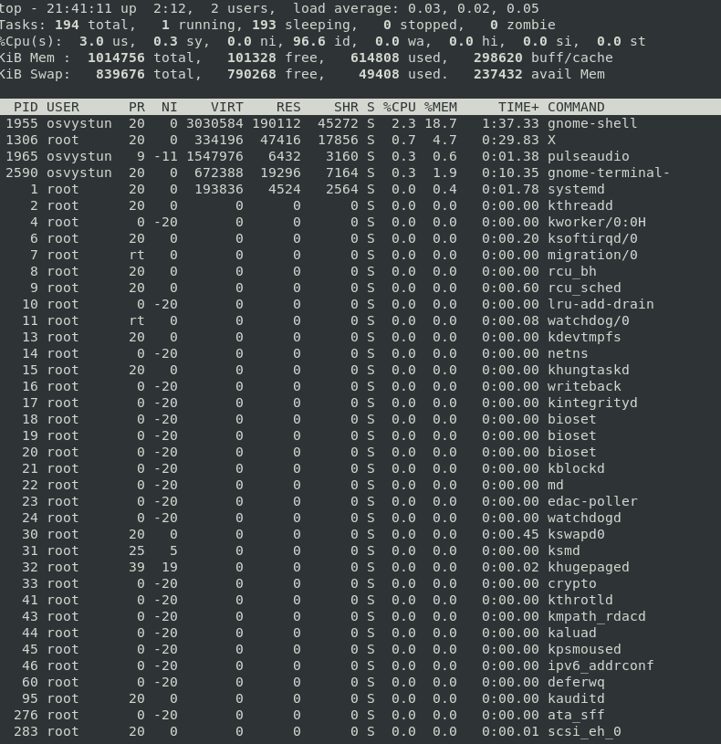

13. Sort the contents of the processes window using various parameters (for example, the amount of processor time taken up, etc.).

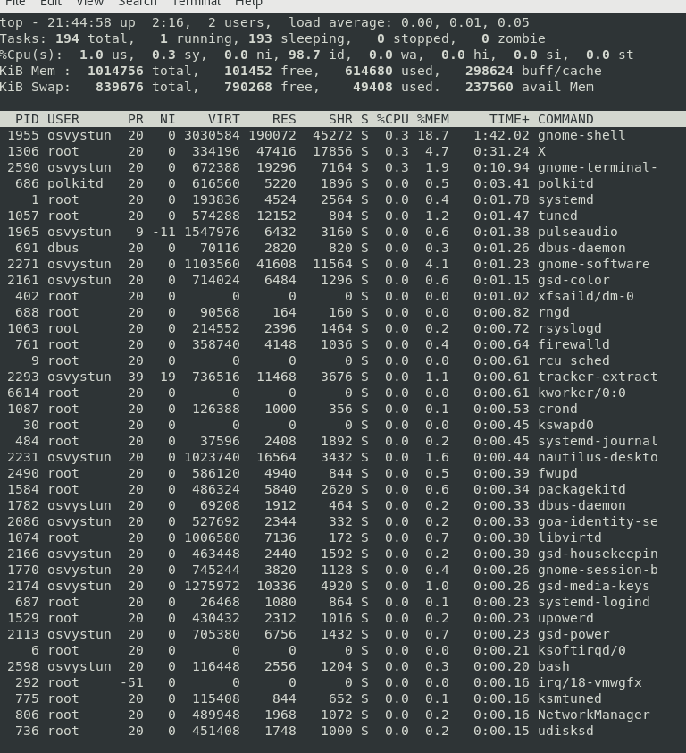

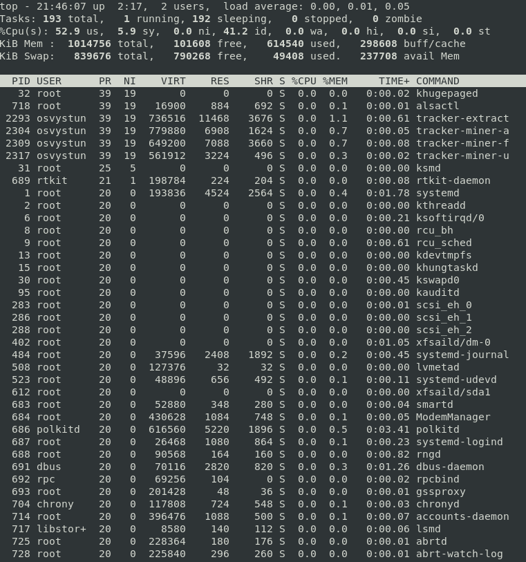

14. Concept of priority, what commands are used to set priority?

Answer:
nice command is used for modifying scheduling priorety, but nice command can make process only lesser in priority, whereas renice command can do it in both ways - to increase and decrease priority.

15. Can I change the priority of a process using the top command? If so, how?

Answer:
Yes, by pressing r key when in top, then entering pid and then a priority value(dont forget to use these commands with sudo).

16. Examine the kill command. How to send with the kill command process control signal? Give an example of commonly used signals.

Answer:
To send control signal with the kill command you can use kill -c [USERNAME] [PID]
1) kill -9 [PID] - kill process immediately 

17. Commands jobs, fg, bg, nohup. What are they for? Use the sleep, yes command to demonstrate the process control mechanism with fg, bg.

Answer:
1) jobs - list jobs
2) bg - put job into background.
3) fg - put job into foreground.

<h2>Part 2</h2>

1. Check the implementability of the most frequently used OPENSSH commands in the MS Windows operating system. (Description of the expected result of the commands + screenshots: command – result should be presented)
2. Implement basic SSH settings to increase the security of the client-server connection (at least
3. List the options for choosing keys for encryption in SSH. Implement 3 of them.
4. Implement port forwarding for the SSH client from the host machine to the guest Linux virtual machine behind NAT.
5*. Intercept (capture) traffic (tcpdump, wireshark) while authorizing the remote client on the server using ssh, telnet, rlogin. Analyze the result.