1. Create virtual machines connection according to figure 1 and configure all network interfaces in order to make VM2 has an access to the Internet (iptables, forward, masquerade).

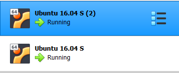

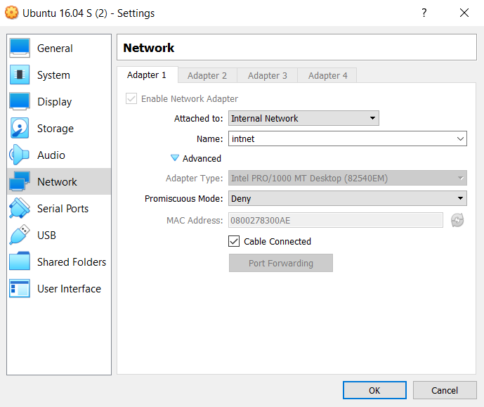

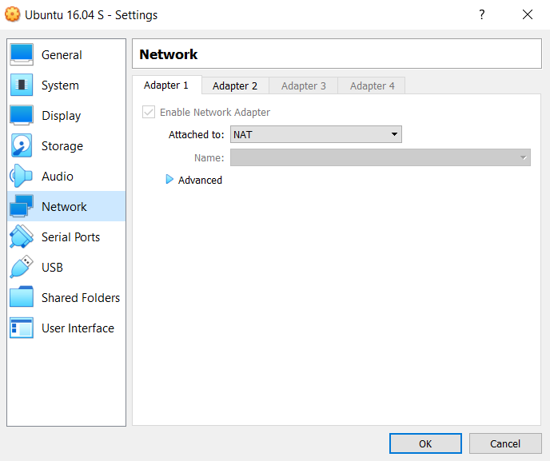

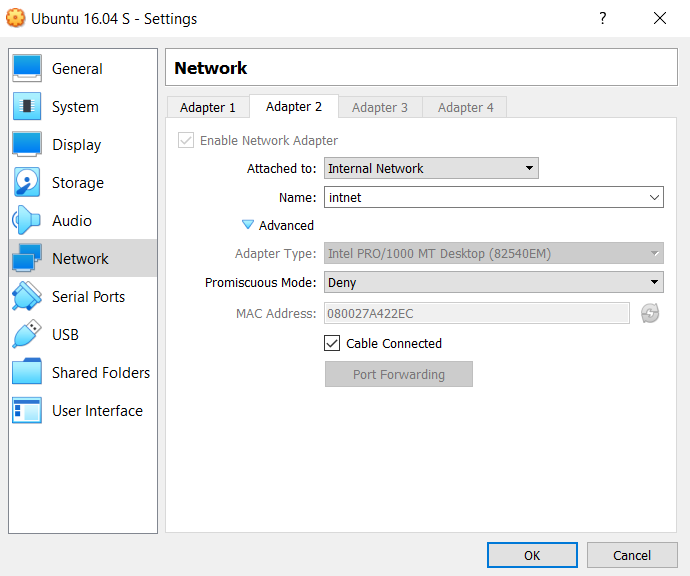

2. Check the route from VM2 to Host.

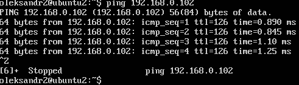

3. Check the access to the Internet, (just ping, for example, 8.8.8.8).

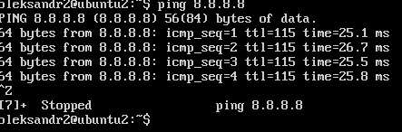

4. Determine, which resource has an IP address 8.8.8.8.

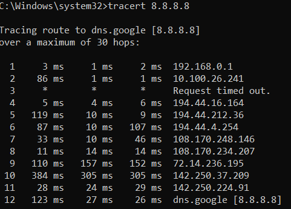

*remark - I couldn't complete this task in linux vm due to this, and I do not know how to resolve it:

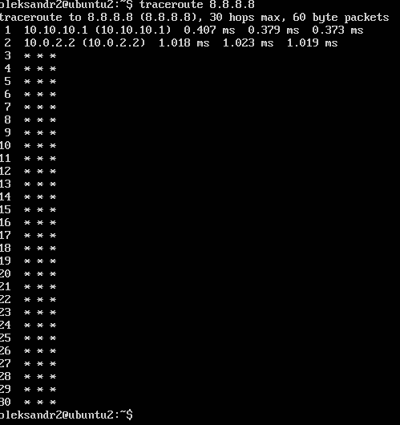

5. Determine, which IP address belongs to resource epam.com.

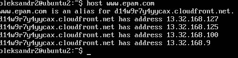

6. Determine the default gateway for your HOST and display routing table.

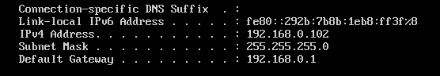

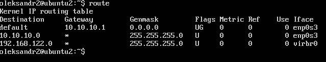

7. Trace the route to google.com.

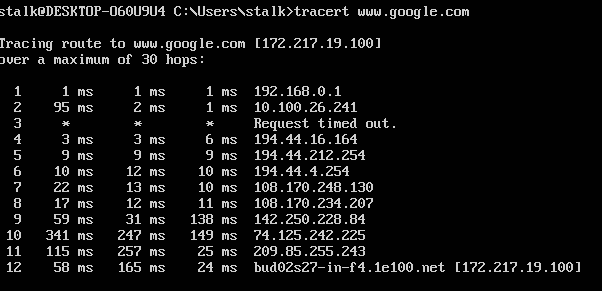